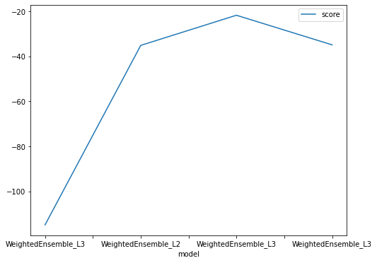
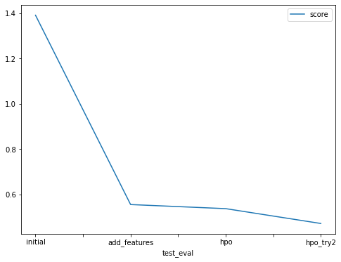

# Report: Predict Bike Sharing Demand with AutoGluon
#### Leqi Lu

## Initial Training
### What did you realize when you tried to submit your predictions? What changes were needed to the output of the predictor to submit your results?
I was not able to submit my predictions initially because some of the prediction values were negative. Kaggle rejects submissions with negative values. In order to submit, I have to set all the negative values to zero.

### What was the top ranked model that performed?
The top ranked model that performed was WeightedEnsemble_L3 with a score of -114.864087.

## Exploratory data analysis and feature creation
### What did the exploratory analysis find and how did you add additional features?
During the exploratory data analysis process, I noticed that the `datetime` column of the dataset can be split into month, day and hour. In order to split the `datetime` column, I used `parse_dates` to parse the `datetime` column when reading in the csv. When it's time to add additional features, the month, day and hour features can be easily accessed with the `dt` function.

### How much better did your model preform after adding additional features and why do you think that is?
I ran the model again with the same settings as before, but with the additional features this time. The best model is WeightedEnsemble_L2 with a score of -35.121969. Adding the new features reveals the hidden relationship of the dataset. Year, month and day may have a higher correlation to the target individually instead of as a whole, we need to extract it to make the model better.

## Hyper parameter tuning
### How much better did your model preform after trying different hyper parameters?
After extending training time to 900s, changing the metric from `root_mean_squared_error` to `mean_absolute_error`, and replacing the preset with `high_quality_fast_inference_only_refit`, my model performed a little better, improving from 0.55462 to 0.53653. I was curious on how much hyper parameters can do, so I extended the training tome to 1500s, used the original metric of `root_mean_squared_error` and preset of `best_quality`, and setting `num_bag_folds` to 5 and `num_stack_levels` to 1, and that raised my score to 0.47091.

### If you were given more time with this dataset, where do you think you would spend more time?
I would spend more time on adding more new features based on the current dataset. For example, derive a `period_of_time` column (morning/afternoon/evening). I would also clean up the data and remove outliers and less important features.

### Create a table with the models you ran, the hyperparameters modified, and the kaggle score.
|model|time|metric|presets|num_bag_folds|num_stack_levels|core|
|--|--|--|--|--|
|WeightedEnsemble_L3|600|root_mean_squared_error|best_quality|None|None|1.39202|
|WeightedEnsemble_L2|600|root_mean_squared_error|best_quality|None|None|0.55462|
|WeightedEnsemble_L3|900|mean_absolute_error|high_quality_fast_inference_only_refit|None|None|0.53653|
|WeightedEnsemble_L3|1500|root_mean_squared_error|best_quality|5|1|0.47091|

### Create a line plot showing the top model score for the three (or more) training runs during the project.

### Create a line plot showing the top kaggle score for the three (or more) prediction submissions during the project.

## Summary
Adding more features helped improving the score a lot, mostly because it reveals hidden correlations between features and our target. After changing the values of some hyperparameters, my score went up by a little bit. However, `high_quality_fast_inference_only_refit` is recommended for applications that require reasonable inference speed and/or model size, which is this case, and `best_quality` is for producing the most accurate overall predictor regardless of its efficiency, which probably is more suitable with our dataset since it is not huge. To experiment with more tuning, I used the original metric and presets, and setting `num_bag_folds` and `num_stack_levels` values to maximize our predictive performance. The training score actually went down with this tuning, while the test score went up.
